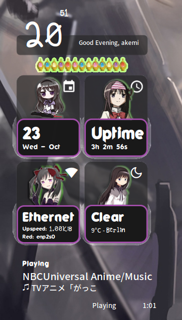

# 📌 Akemi theme for conky

### 🔆 Description: 
This is my first theme for conky, so it might have some bugs. 
Instalation see [How to apply](https://closebox73.wordpress.com/2024/01/02/how-to-apply) if there is an error please read it again.

1. Download the file
2. unzip and copy into ~./home/user/config/conky/ or ~/home/user/.conky/
3. Open ConkyManager y apply the theme.

**✭ Note:** Change the city_id in file _**weather-v2.0.sh**_ ([search your city here](https://openweathermap.org/find) and replace), try to use your own api_key.
For the internet speed, change the line number 74 and 75 in _**akemi.conf**_. *enp2s0* for me, search and replace. In your terminal use: 
> ip -br l | awk '$1 !~ "lo|vir|wl" { print $1}'

##

if there is a problem with the background image (PNG) that looks faded or transparent, please change it in this config
> * draw_blended = false,
> * own_window_argb_visual = false,
> * own_window_transparent = true,

##

Try experimenting with replacing it with true or false, if suddenly Conky doesn't appear don't panic, just undo and restart Conky

  

##

  

### 🔆 Extra:
* Created on 1920x1080 Monitor 🖥️
* for conky 1.21.7 or newer
* I've only tried it on Manjaro XFCE, so It could be that for other DEs there are different configurations in the theme. Please try it yourself.

**✭ Note:** Credits to [closebox73x](https://store.kde.org/u/closebox73x). I was inspired by this [theme](https://store.kde.org/p/2199800)
